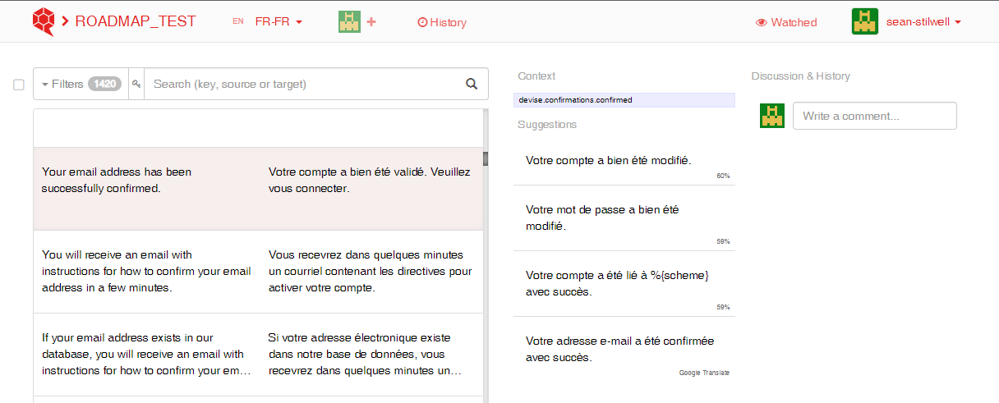

# Setting Up DMPRoadmap on a Ubuntu Machine

Start by following the [installation guide](https://github.com/DMPRoadmap/roadmap/wiki/Installation) on the DMPRoadmap GitHub repo. You have a choice of either using PostgreSQL or MySQL, **use PostgreSQL**.

Upon completion of that installation, you can follow this guide to adapt it to our needs.

## Update User Permissions Cronjob

To ensure users have access to managing templates, we use a cronjob to update the user permissions in the database.

1. Run `touch cronjob_user_perms.sql`
2. Use `nano cronjob_user_perms.sql` to begin modifying the file.
3. Add the following to the file to grant the user permission 4 when they don't already have that permission: 
```
INSERT INTO user_perms (user_id, perm_id)
SELECT u.id, 4
FROM USERS u 
WHERE NOT EXISTS 
    (SELECT * FROM user_perms p 
    WHERE u.id = p.user_id AND perm_id = 4);
```
4. Press Ctrl+O to save the SQL file and then Ctrl+X to exit.
5. Run `touch dmproadmap_userperms_cron.sh`
6. Use `nano dmproadmap_userperms_cron.sh` to begin modifying the file.
7. Add the following to the file to run the SQL file we created earlier, updating [PATH] to the path to the SQL file: 
```
#!/bin/sh
psql -U postgres -h localhost -d dmproadmap -f [PATH]/cronjob_user_perms.sql
```
8. Press Ctrl+O to save the shell file and then Ctrl+X to exit.
9. Use `crontab -e` to modify the cronjob list.
10. Add the bottom of the file, add `0 * * * * [PATH]/dmproadmap_userperms_cron.sh`. Replace [PATH] with the path to your shell file. This means that every hour (i.e minutes = 0), users will be granted the permission.
11. Press Ctrl+O to save the crontab file and then Ctrl+X to exit.
12. Run `touch .pgpass` to create a file to save your PostgreSQL password so that the cronjob can use it.
13. Add the line `localhost:5432:[USER]:postgres:[PASSWORD]`, replacing the two fields with your username and password.
14. Press Ctrl+O and Ctrl+X to save and exit the password file.
15. Run `chmod +x dmproadmap_userperms_cron.sh` to make the shell file executable.
16. [ ] Use the command `./dmproadmap_userperms_cron.sh` to test and ensure the file runs. You should see `INSERT 0 0` (if no insertions are needed).

## Starting Server on Machine Restart
1. Run `touch rails_server_start.sh` to create the shell script that will be executed.
2. Add the following to the file to navigate into the roadmap repo and start the server to be publicly accessible:
```
#!/bin/sh

cd [PATH_TO_REPO] && rails server -b 0.0.0.0
```
3. Press Ctrl+O and Ctrl+X to save and exit the shell file.
4. Use `crontab -e` to modify the cronjob list.
5. At the bottom of the file, add `@reboot [PATH]/rails_server_start.sh`, replacing [PATH] with the path to your shell file. This will run your shell file every time the machine is rebooted, starting the rails server.
6. Press Ctrl+O to save the crontab file and then Ctrl+X to exit.
7. Run `chmod +x rails_server_start.sh` to make the shell file executable.
8. [ ] Use the command `./rails_server_start.sh` to test and ensure the shell file runs properly. You should see the rails server start and be able to visit DMPRoadmap.

## Making Text Updates
Before adding or changing text on DMPRoadmap, ensure you do the following:
1. Ensure you have a translation.io account (You can sign up using your GitHub account).
2. If you're using an existing instance, make sure you've been added to the translation.io project for the instance. Otherwise, create a project on translation.io, follow instructions, and run `rake translation:init` from the terminal.
    * Note: translation.io is free for open source projects. You provide the GitHub repo for your code for free use.

To add or change text, follow these steps:
1. Use the translation gem format to ensure text is formatted properly.
    * For example, if you want to add `<p>This is my text</p>`, you would put `<%= sanitize _("<p>This is my text</p>") %>`
    * The `<%= %>` tags are to use Rails, the `_()` surrounding your text are to indicate a translatable text.
2. Run `rake translation:sync` in the terminal.
3. Visit the project on translation.io. If your text has not yet been translated, you can use the "Untranslated" tag to find it.
    * Example: If you added `<p>Your email address has been successfully confirmed</p>`, you might see the following. Some suggestions are provided to the right.

4. Provide your translation or select a given one.
5. Run `rake translation:sync` in the terminal.
6. Your text should be updated on the French version of the app.